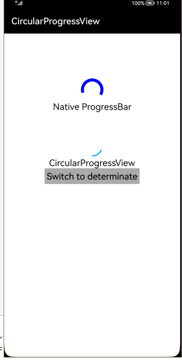

## CircularProgressView

## Introduction
This CircularProgressView is a (surprisingly) circular progress bar openharmony View that is designed to imitate the Material versions of ProgressBar. These versions can be seen on this page of the Material design spec under Circular indicators.

## Usage Instructions

### Indeterminate:
progress view starts & never stops, keeps rotating

add the view to your layout:

```xml
<com.github.rahatarmanahmed.cpv.CircularProgressView
        ohos:id="$+id:progress_view"
        ohos:height="50vp"
        ohos:width="50vp"
        ohos:layout_alignment="horizontal_center"
        ohos:padding="0vp"
        ohos:top_margin="50vp"
        app:cpv_animAutostart="false"
        app:cpv_indeterminate="true"      
        app:cpv_thickness="8"/>
```
</img>


### Determinate:
progress view starts & stops after full circle
add the view to your layout:

  ```xml
<com.github.rahatarmanahmed.cpv.CircularProgressView
        ohos:id="$+id:progress_view"
        ohos:height="50vp"
        ohos:width="50vp"
        ohos:layout_alignment="horizontal_center"
        ohos:padding="0vp"
        ohos:top_margin="50vp"
        app:cpv_animAutostart="false"
        app:cpv_indeterminate="true"
        app:cpv_thickness="8"/>

    <Text
        ohos:id="$+id:progress_view_label"
        ohos:height="match_content"
        ohos:width="match_content"
        ohos:layout_alignment="horizontal_center"
        ohos:text="CircularProgressView"
        ohos:text_size="20fp"/>

    <Button
        ohos:id="$+id:button"
        ohos:height="match_content"
        ohos:width="match_content"
        ohos:layout_alignment="horizontal_center"
        ohos:padding="5vp"
        ohos:text="Switch to Determinate"
        ohos:text_size="20fp"/>
```
</img>


## Installation Instruction
```
Method 1: Generate har package from library and add it to lib folder.
       add following code to gradle of entry

       implementation fileTree(dir: 'libs', include: ['*.jar', '*.har'])
       
Method 2:
    allprojects{
        repositories{
            mavenCentral()
        }
    }

    implementation 'io.openharmony.tpc.thirdlib:CircularProgressView:1.0.1'
```
